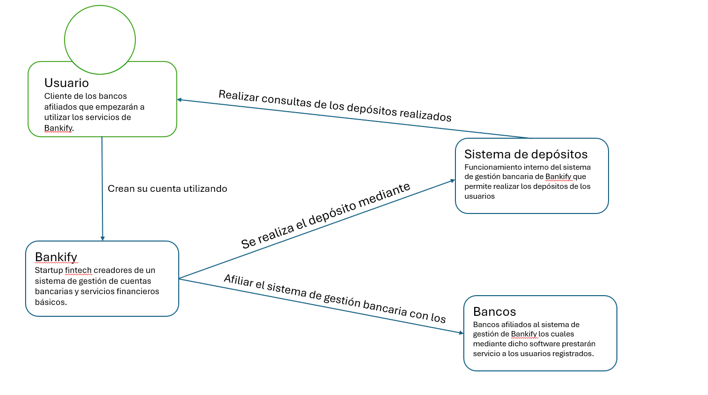
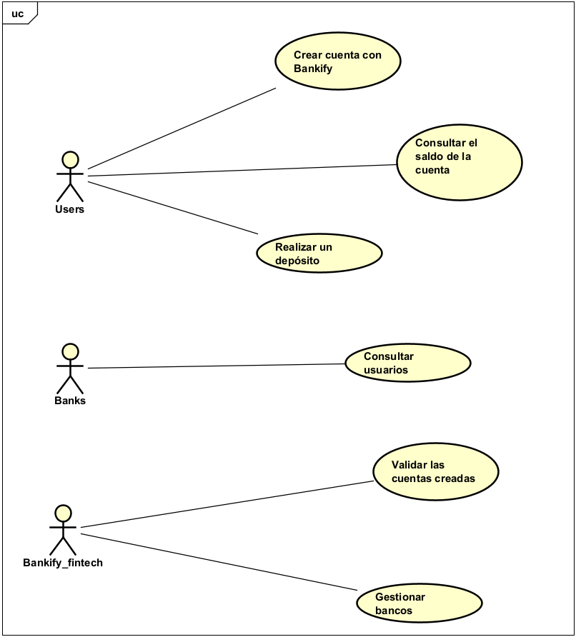
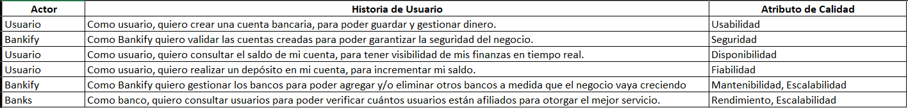
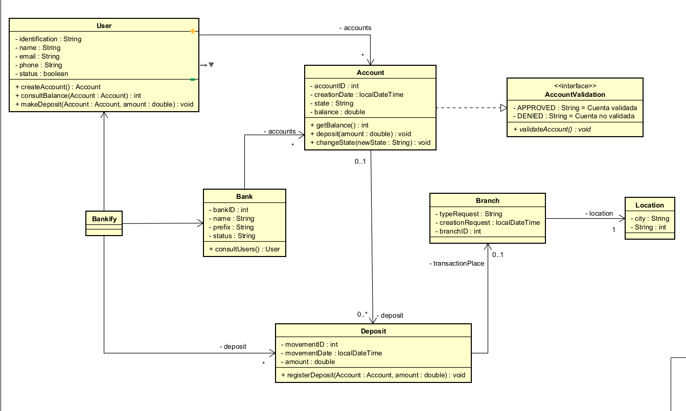
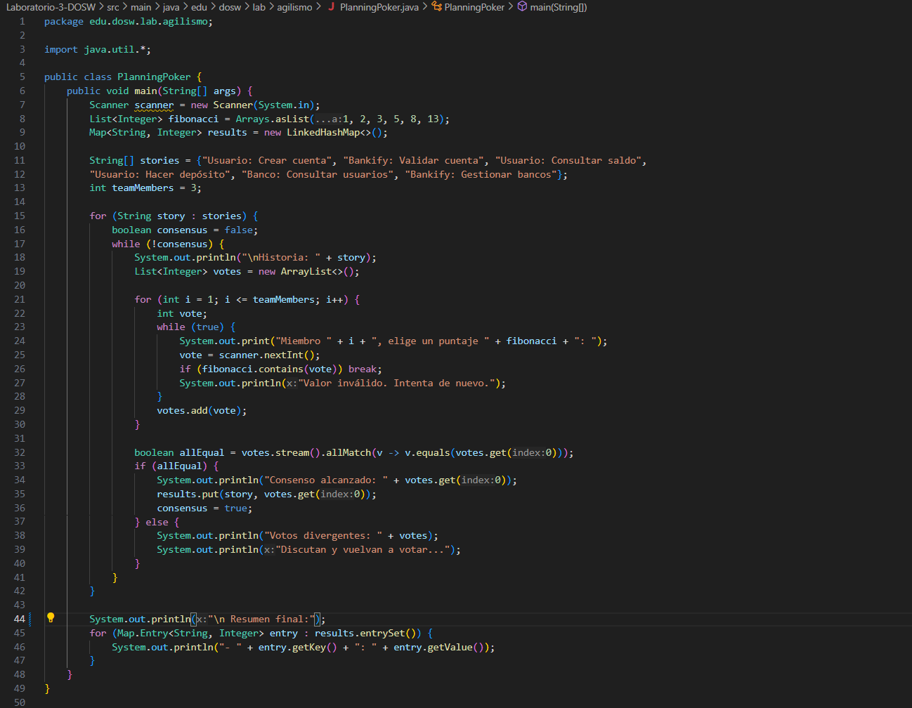
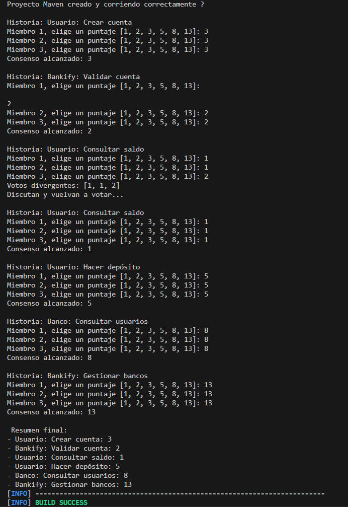

# 💻 Laboratorio-3-DOSW

## 📌 Identificando Requerimientos  

### ⚖️ Reglas de Negocio  
El software debe cumplir con:  
- ✅ Altos estándares de calidad  
- 🔧 Alta mantenibilidad  
- 🔒 Alta seguridad  
- 🚀 Uso de **Metodologías Ágiles**  
- 🧪 Aplicación de **TDD (Test-Driven Development)**  
- 📊 Buen índice de cobertura de código (**JaCoCo**)  
- 🧹 Buen análisis estático (**SonarQube**)  

---

### 🚀 Funcionalidades Principales  
El software permitirá:  
- 👤 Crear cuentas a clientes  
- ✔️ Validar cuentas de clientes  
- 💰 Consultar el saldo de una cuenta  
- 💵 Realizar un depósito  

---

### 🧑‍🤝‍🧑 Actores del Sistema  
- **Usuarios:** Personas que usarán el software  
- **Bancos Registrados:** Asociados con la startup para generar beneficios  
- **Bankify:** La startup fintech que administrará el software  

---

### ⚙️ Precondiciones del Sistema  
- 📌 Los números de cuenta deben tener **10 dígitos**  
- 🏦 Los **2 primeros dígitos** representan bancos registrados:  
  - `01` → BANCOLOMBIA  
  - `02` → DAVIVIENDA  
- 🚫 Números de cuenta **sin letras**  
- 🚫 Números de cuenta **sin caracteres especiales**  

## Diseñando

### Diagrama de contexto de la solución

	

Este diagrama de contexto, debido a que el problema del reto a realizar es algo breve, de igual manera este diagrama lo es.
Inicia con la creación de la cuenta por parte de un usuario la cual se crea en el Bankify.
Este Startup fintech está vinculado con un par de bancos, en este caso Bancolombia y Davivienda, por ende existe la relación entre Bankify y los bancos. 
Y de igual manera, este startup tiene el sistema de depósitos para que los usuarios puedan agregar dinero a sus cuentas. 
Se asocia el sistema de depósitos con los usuarios debido a que son estos quienes hacen los depósitos y de igual manera los usuarios pueden consultar el total de dinero dentro de sus cuentas.

### Diagrama de casos de uso: Actores e historias de usuario

	

Definido en la parte #1, los actores identificados fueron los usuarios, los bancos registrados y Bankify.
Mediante estos actores se crea el diagrama y se identifica los requerimientos funcionales de los que cada actor estaría encargado y/o querrían ver dentro del software.
En base a los requerimientos funcionales, se crearon las historias de usuario, manteniendo la relación del actor y el requerimiento.

	

Esas fueron las historias de usuario generadas de los requerimientos funcionales identificados. Pero más allá de solo las historias de usuario, se identificaron los atributos de calidad de cada historia de usuario resuelve, y entre más vaya creciendo el proyecto en base a nuevos requerimientos, más bancos trabajando en compañía del Startup, más atributos de calidad se irán resolviendo y potenciando para crear un producto de software apto y perfecto para los usuarios.

### Diagrama de clases

	

Por último, se desarrolló el diagrama de clases con los requerimientos solicitados. Tenemos una clase controlador llamada "Bankify", la cual será la encargada de manejar toda la lógica, más sin embargo, el funcionamiento viene de las otras clases.

En primer lugar nos encontramos con Bank, la clase que creará los bancos y en caso que más bancos se afilien, será más sencillo poder agregarlos, de igual manera que si se llegan a crear nuevos requerimientos, por ejemplo algún tipo de tasas de interéses, transferencias interbancarias, esta clase al resolver toda la parte de los bancos lo vuelve sencillo. También tenemos la clase User, encargada de todo el manejo de los usuarios (para que tenga una clase propia y no se trabaje desde Bankify).

De ahí pasamos a la clase Account, será la encargada de toda la parte de la creación de la cuenta de las personas, en donde se guarda el dinero y la información del usuario; esta clase implementa la interfaz AccountValidate (parte de los requerimientos), en donde en pro de la seguridad del software se hará una validación de la cuenta de si satisface las normas o no.

Pasamos con la clase "Deposit", que es por ahora la única función que se puede realizar (Depósito de dinero), en donde se efectúa el depósito hacia las cuentas de los usuarios; estos depósitos deben contar con un sucursal desde donde se realiza el depósito, sea físico o digital, y esta es la labor que cumple la clase "Branch", la cual termina teniendo relación con la clase "Location" que es la que tiene la ubicación exacta de dicha sucursal.

## Una estimación automatizada

### Simulación de una sesión de Planning Poker

Lo que se hizo para agilizar procesos fue colocar las historias de usuario definidas en el punto anterior en un arreglo de Strings (porque se pensó en un diccionario que es un Map, pero como no se puede tener la clave repetida, se tuvo que dejarlo como un arreglo), y se trabajó con scanners porque tocaba hacer la votación desde comandos.

Se colocaron en un ArrayList los valores de Fibonacci para poder realizar la votación y en caso que los valores no sean iguales, se vuelve a discutir y se vota hasta que todos tengan los mismos números.

	

Tuvimos una charla evaluando las historias de usuario que se colocaron (los cuales se vienen trabajando desde Reto#1) y todos estuvimos de acuerdo; se discutió sobre qué actor tiene que tener la historia de usuario de Consultar saldo pero al final todos estuvimos de acuerdo. A continuación se evidencian los resultados:

	

